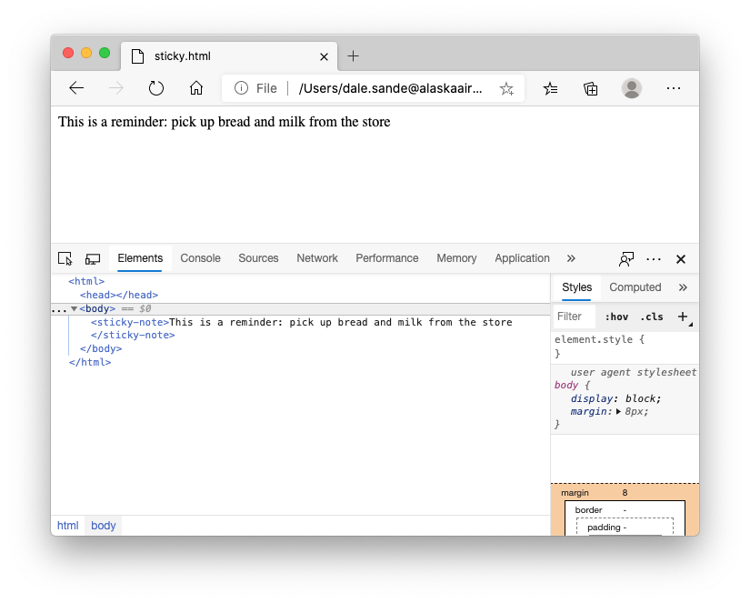

# The slot element, performance and SEO

> The HTML `<slot>` element—part of the Web Components technology suite—is a placeholder inside a web component that you can fill with your own markup, which lets you create separate DOM trees and present them together.

[MDN reference](https://developer.mozilla.org/en-US/docs/Web/HTML/Element/slot)

What does this mean and why is this a huge benefit of web components over other JavaScript framework components? To really understand this, you must understand that HYML and browsers in general are based on progressive enhancement. 

The principal of progressive enhancement is, regardless of the code pushed to the browser, the browser will render the UI. While this is not specifically true for JavaScript, this is true for HTML and CSS. 

In web development, we can easily send code to the browser that the browser will do its best to render, but if it does not know what to do with the code, it simply moves on. For example, if the following code was present in a HTML document and sent to the browser, the browser would just render the string within. 

```html
<sticky-note>This is a reminder: pick up bread and milk from the store</sticky-note>
```

As you can see in the image below, the browser has no understanding of an HTML element called `sticky-note`, but it still renders it without blocking or error. 



## Why does this matter? 

The true benefit that Web Components have over any other JavaScript framework is that the author of the UI can use the custom element they created in native HTML, and with use of the `slot` element, the content is clearly visible to the browser without any rendering what so ever. 

It is an important architectural piece of the Web Component development process to place content that is needed to be considered important for SEO be placed within the `<slot> ... </slot>` elements. 
